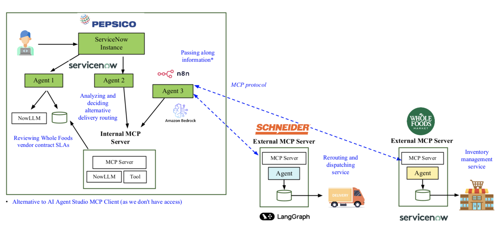

# PepsiCo Supply Chain Incident Processing - ServiceNow Implementation

## System Overview

This repository demonstrates an automated supply chain incident processing system for PepsiCo that processes truck breakdowns through sequential AI agents and external workflow coordination. When delivery trucks break down, the system calculates financial impacts, selects optimal routes, and coordinates execution with external logistics providers.

The solution uses a three-agent architecture: two ServiceNow AI agents for internal processing and one N8N agent for external system coordination via MCP protocol.

## Implementation Steps

### 1. Application Setup

Created **"PepsiCo Deliveries"** scoped application with two custom tables:

| Table                | Purpose                 | Key Fields                                                          |
| -------------------- | ----------------------- | ------------------------------------------------------------------- |
| **Delivery Delay**   | Central workflow state  | route_id, status, calculated_impact, chosen_option, incident_sys_id |
| **Supply Agreement** | Customer contract terms | customer_id, deliver_window_hours, stockout_penalty_rate            |

Sample data: Whole Foods contract (customer_id: 1, 3-hour window, $250/hour penalty)

### 2. Sequential Agent Configuration

#### Agent 1: Route Financial Analysis Agent

**Purpose:** Analyze financial impact and create incident tracking

**Tools Configured:**
- Select Delivery Delay Details for Financial Analysis
- Select Supply Agreement (contract lookup) 
- Update Delivery Delay record with calculated financial impact analysis
- Create Incident Record
- Update Delivery Delay table with associated incidents information

**Key Processing:**
- Triggers on status="pending"
- Calculates delay costs using Math tool with actual contract data
- Outputs financial analysis in JSON format
- Creates incident records with sys_id linking
- Updates status to "calculated"

#### Agent 2: Route Decision Agent  

**Purpose:** Select optimal routes and trigger external execution

**Tools Configured:**
- Select Delivery Delay Details for Route Decision
- Update Delivery Delay With Chosen Option
- Update Incident Record Priority
- POST to N8N Webhook (script tool)

**Key Processing:**
- Triggers on status="calculated" 
- Analyzes routes using financial data from Agent 1
- Selects lowest-cost option with delivery time consideration
- Updates incident priority based on financial impact
- Triggers N8N via webhook, updates status to "approved"

### 3. N8N External Coordination

**Workflow Architecture:**

| Node                      | Purpose                               | Configuration                                                            |
| ------------------------- | ------------------------------------- | ------------------------------------------------------------------------ |
| **Webhook**               | Receives ServiceNow routing decisions | Listens for POST requests with route_id, truck_id, chosen_option payload |
| **AI Agent**              | Coordinates external systems          | Uses AWS Bedrock Chat Model for decision processing                      |
| **Logistics MCP Client**  | Schneider integration                 | Connects to Schneider MCP Server for route execution                     |
| **Retail MCP Client**     | Whole Foods integration               | Connects to Whole Foods MCP Server for customer notifications            |
| **ServiceNow MCP Client** | Status updates                        | Updates ServiceNow execution status via MCP protocol                     |
| **Webhook Response**      | Completes cycle                       | Returns confirmation to ServiceNow                                       |

**MCP Client Tool Configurations:**

**Logistics MCP Client Tools:**
- `execute_route(route_id, truck_id, chosen_option)` - Execute routing decision at Schneider
  - Parameters: route_id, truck_id, chosen_option object with option_id, route_number, distance_miles, eta_minutes
  - Server Location: Schneider infrastructure
  - Protocol: MCP with full routing payload

**Retail MCP Client Tools:**  
- `notify_delivery_delay(route_id, truck_id, chosen_option)` - Send delivery notifications to Whole Foods
  - Parameters: route_id, truck_id, chosen_option object with option_id, route_number, distance_miles, eta_minutes
  - Server Location: Whole Foods infrastructure  
  - Protocol: MCP with same routing payload structure as Logistics client

**ServiceNow MCP Client Tools:**
- `update_execution_status(route_id, status)` - Update ServiceNow execution status
  - Parameters: route_id, status ("dispatched")
  - Server Location: PepsiCo infrastructure
  - Authentication: Bearer token provided in N8N environment

**N8N Agent Processing Logic:**
1. Receives webhook payload from ServiceNow Route Decision Agent
2. Constructs MCP payloads using actual webhook data values (not template strings)
3. Executes route via Logistics MCP Client with full chosen_option details
4. Notifies customer via Retail MCP Client with identical payload structure
5. Updates ServiceNow status to "dispatched" via ServiceNow MCP Client
6. Returns completion confirmation to ServiceNow webhook

**Payload Structure Examples:**

```json
// ServiceNow → N8N Webhook
{
  "route_id": "417238",
  "truck_id": "5849", 
  "chosen_option": {
    "option_id": "opt-1",
    "route_number": 6,
    "distance_miles": 181,
    "eta_minutes": 186
  }
}

// N8N → Logistics/Retail MCP (same structure)
{
  "route_id": "417238",
  "truck_id": "5849",
  "chosen_option": {
    "option_id": "opt-1", 
    "route_number": 6,
    "distance_miles": 181,
    "eta_minutes": 186
  }
}

// N8N → ServiceNow MCP  
{
  "route_id": "417238",
  "status": "dispatched"
}
```

### 4. Integration Patterns

**Sequential Processing:** Agent 1 → Agent 2 → N8N execution  
**Status Progression:** pending → calculated → approved → dispatched  
**Webhook Integration:** ServiceNow script tool triggers N8N with route_id, truck_id, chosen_option payload  
**MCP Protocol:** N8N coordinates with three external systems using standardized payloads

## Architecture Diagram



Three-phase workflow: Problem Detection & Analysis → Route Decision Making → External Execution

## Optimization

### Script Configuration
- Webhook URL configured as variable in call-n8n-webhook.js
- Comprehensive error handling with structured response logging
- Proper payload construction using actual record data

### Agent Processing  
- Math tool uses specific data values for accurate penalty calculations
- Efficient record operations with minimal database queries
- incident_sys_id linking provides complete audit trails

### External Integration
- MCP protocol standardization across all external communications
- Status-based workflow management enables error recovery
- Bearer token authentication for ServiceNow MCP Client

## Testing Results

### Functional Validation

**Agent 1 Testing:**
- Successfully calculated delay costs using Whole Foods contract ($250/hour penalty)
- Created incident records with comprehensive financial breakdowns
- Proper JSON formatting of calculated_impact field
- Status progression from "pending" to "calculated"

**Agent 2 Testing:**  
- Analyzed financial data and selected optimal routes
- Updated incident priorities based on cost impact
- Successfully triggered N8N webhook with proper payload
- Status progression to "approved"

**N8N Integration:**
- Confirmed webhook reception and payload processing
- Verified MCP communications with Schneider, Whole Foods, ServiceNow
- Status updates to "dispatched" upon completion

### Manual Testing
When automatic triggers required configuration adjustments, validated functionality through AI Agent Studio using specific route_id values from existing Delivery Delay records.

## Business Value

**Automated Financial Analysis:** Eliminates manual penalty calculations, reducing response time from hours to minutes while ensuring accurate cost analysis based on actual contract terms.

**Optimal Route Selection:** AI-driven analysis considers both financial impact and delivery constraints, minimizing contractual penalties while maintaining customer satisfaction.

**External System Coordination:** MCP protocol integration provides seamless coordination with logistics providers and customer notification systems, ensuring all stakeholders receive timely updates.

**Complete Audit Trail:** Status progression tracking and incident_sys_id linking provide comprehensive audit trails for compliance and continuous improvement.

**Scalable Architecture:** Webhook-triggered N8N coordination and MCP protocol standardization enable rapid expansion to additional supply chain partners.

The system transforms PepsiCo's supply chain incident response from manual, time-intensive processes to intelligent, automated workflows that protect customer relationships and minimize financial impact during delivery disruptions.